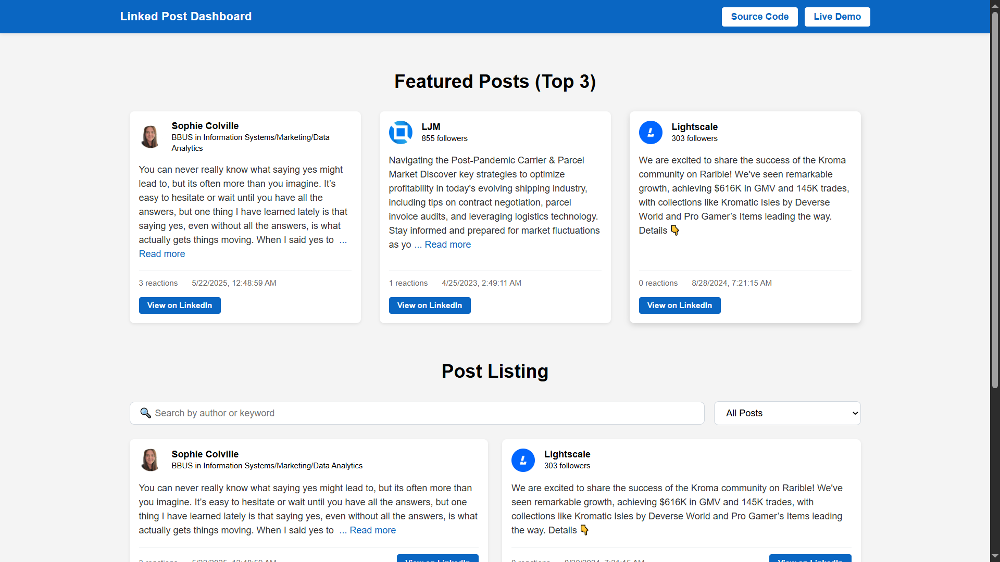

# Linked Post Dashboard

A React-based LinkedIn insights dashboard that fetches and displays public LinkedIn posts with filters, featured highlights, responsive cards, and a professional UI.

### 🚀 Features

- Search posts by keyword or author name
- Filter by post type (original, reshared, video)
- Featured top 3 engaging posts
- Responsive layout
- Skeleton loading placeholders
- Reshared post support
- Reusable, component-driven architecture

## 📸 Live Preview

Please visit [React Assignment CFlow - Live](https://react-assignment-cflow.netlify.app) to see the site's live preview.



## 🛠 How to Run Locally

1. Clone the repository:

   ```bash
   git clone https://github.com/yodkwtf/react-assignment-cflow.git
   ```

2. Navigate to the project directory:

   ```bash
   cd react-assignment-cflow
   ```

3. Install dependencies:

   ```bash
    npm install
   ```

4. Create a `.env` file in the root directory and add your RapidAPI key:

   ```.env
   REACT_APP_RAPIDAPI_KEY=<YOUR_RAPIDAPI_KEY>
   REACT_APP_RAPIDAPI_HOST=<YOUR_RAPIDAPI_HOST>
   ```

5. Start the development server:

   ```bash
    npm start
   ```

6. Open your browser and navigate to `http://localhost:3000`.
7. Enjoy the LinkedIn insights dashboard!

## 🧠 Assumptions Made

- The API response format follows what RapidAPI provides (with resharedPost, image, video, author etc.)
- Reshared content includes either an author or a company name.
- API pagination and error handling are minimal for demo purposes.
- All posts are considered public and require no LinkedIn authentication.

## 📞 Contact

For any questions or feedback, please reach out to me through the sources below:

- **Email:** [48durgesh.chaudhary@gmail.com](mailto:48durgesh.chaudhary@gmail.com)
- **LinkedIn:** [Durgesh Chaudhary](https://www.linkedin.com/in/durgesh-chaudhary/)
- **GitHub:** [@yodkwtf](https://github.com/yodkwtf)
